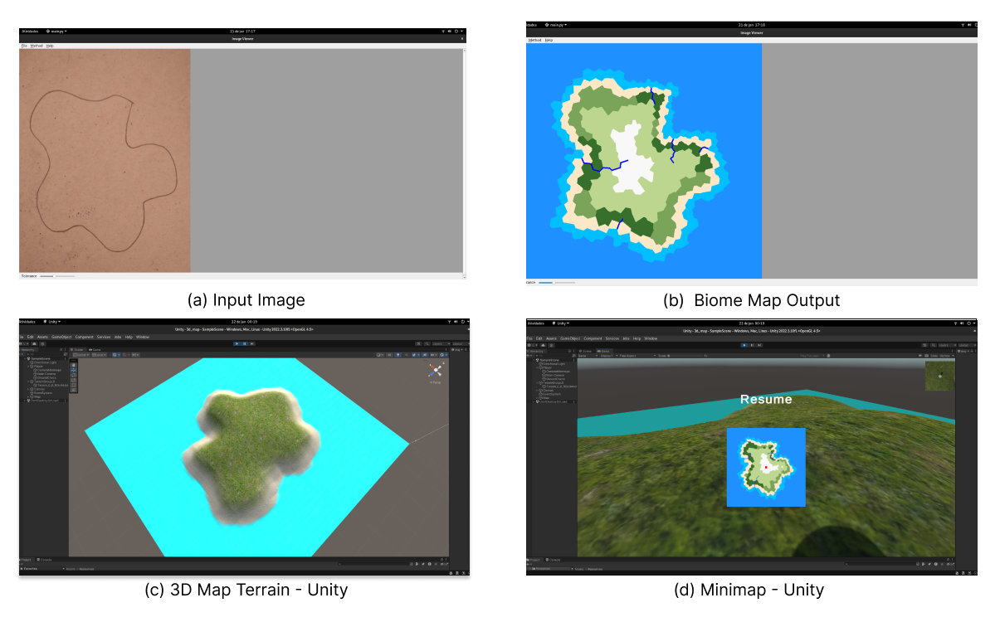

# Procedural Generation of Maps for Games Through Image Segmentation Techniques

[](https://github.com/Lds20k/senac-tcc/blob/main/README.md)
[](https://github.com/Lds20k/senac-tcc/blob/main/README.pt-br.md)

**Undergraduate Thesis | Bachelor of Computer Science - Senac**

**Authors:**
- Rafael Nascimento Lourenço
- Lucas da Silva Santos
- Matheus Zanivan Andrade

## Demo

### Video on [Youtube](https://www.youtube.com/watch?v=DYGtRtT66Nw)



## Citation

```
@article{proceduralGenerationSegmentation,
  title={Geração Procedural de Mapas para Jogos Através de Técnicas de Segmentação de Imagem},
  author={Rafael Lourenço and Lucas Santos and Matheus Andrade},
  howpublished={GitHub Repository},
  year={2023},
  url={https://github.com/Lds20k/senac-tcc},
  note = {Access on: \today}
}
```

## System Requirements
* Debian

## Installation
### UnityHub
```sh
su
## Enter your root password ##

# Add the Unity repository certificate #
wget -qO - https://hub.unity3d.com/linux/keys/public | gpg --dearmor | sudo tee /usr/share/keyrings/Unity_Technologies_ApS.gpg > /dev/null

# Add the Unity repository #
sh -c 'echo "deb [signed-by=/usr/share/keyrings/Unity_Technologies_ApS.gpg] https://hub.unity3d.com/linux/repos/deb stable main" > /etc/apt/sources.list.d/unityhub.list'

# Update package information from all sources #
apt update

# Install UnityHub #
apt-get install unityhub
```
### Miniconda
```sh
mkdir -p ~/miniconda3
wget https://repo.anaconda.com/miniconda/Miniconda3-latest-Linux-x86_64.sh -O ~/miniconda3/miniconda.sh
bash ~/miniconda3/miniconda.sh -b -u -p ~/miniconda3
rm -rf ~/miniconda3/miniconda.sh

~/miniconda3/bin/conda init bash
~/miniconda3/bin/conda init zsh
```

### EfficientPS
```sh
conda env create -n senac-tcc --file=environment.yml
conda activate senac-tcc
conda install pytorch==1.7.0 torchvision==0.8.0 torchaudio==0.7.0 cudatoolkit=10.2 cudatoolkit-dev -c pytorch -c conda-forge
pip install -r requirements.txt

cd src/efficientNet
python setup.py develop

cd ..
python setup.py develop
```


