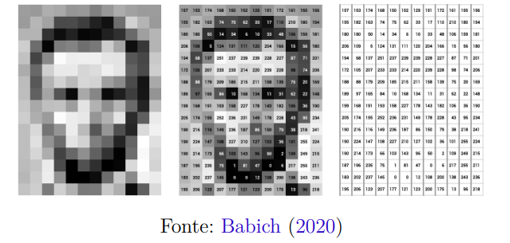
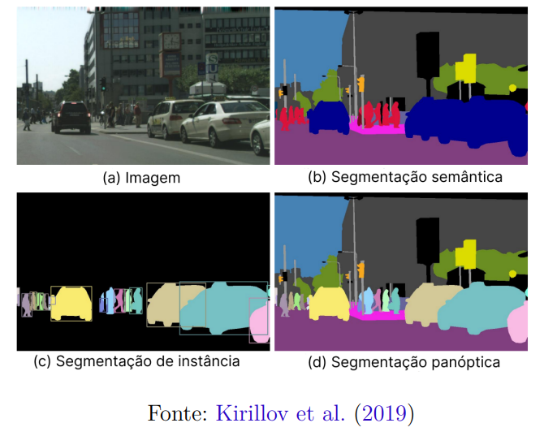
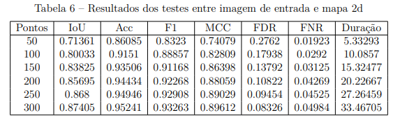
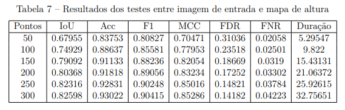
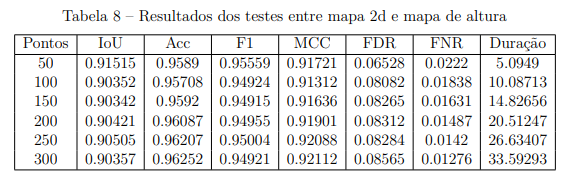
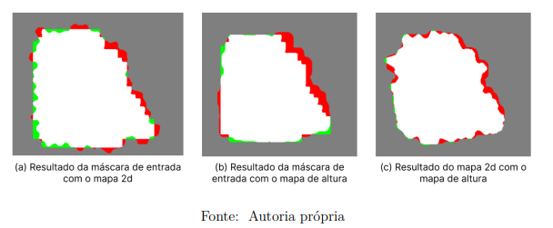
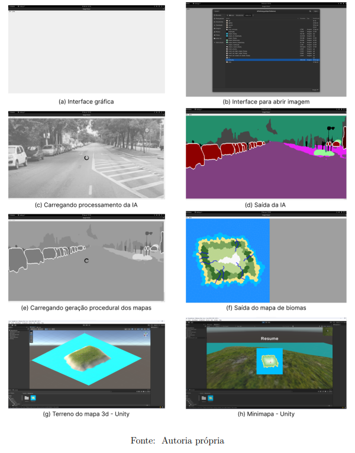

# Capitulo 2
Será abordada uma breve fundamentação para compreensão do desenvolvimento.

## Visão computacional
Uma área que visa interpretação de imagens por meio de algoritmos e técnicas de processamento de imagens.
Para representar uma imagem no computador utiliza-se uma matriz para tal, em uma imagem preto e branco tem apenas 1 canal então só tem uma matriz para simbolizar a cor de cada pixel. Já em rgb tem três canais para representar o RGB.

Dentre técnicas de processamento de imagem cabe ressaltar a imagem ou máscara binária, que cria um foco em algum objeto da imagem, sendo o alvo a parte branca e o fundo preto, tendo apenas duas tonalidades como a imagem de resultado.

Além disso será abordado dois algoritmos com propostas parecidas para selecionar um objeto e
destaca-lo em uma imagem binária. Preenchimento por inundação e por cor.

Por cor se baseia em percorrer todos os pixeis da imagem e destacar quando for da mesma faixa de cor inicial.

Preenchimento por inundação é um algoritmo de
expansão a partir de um pixel, validando se contém a mesma faixa de cor.

E para proporcionar essa interação com a imagem existe a biblioteca PyQt5 que possibilita criação de interfaces em Python.

## Inteligência artificial

É uma tentativa de simular o pensamento humano com processamento computacional, dentro dela existe o aprendizado de máquina que detecta padrões importantes de
uma base de dados e dentro existe a rede neural artificial que é uma representação matemática de unidades de processamento conectadas chamadas de neurônios artificiais. Dentro disso existe a área de rede neural convolucional que visa  detectar padrões em imagens contendo uma camada convolucional para extrair matematicamente um mapa de características. Dentro disso existe área de segmentação que visa separar em conjuntos a imagem, existem três principais ramos sendo eles: segmentação semântica que classifica os pixeis da imagem, a segmentação de instância detecta todos objetos separadamente e a segmentação panóptica junta as duas anteriores para ter uma solução mais completa.

O artigo denominado segmentação panóptica definiu o conceito desse tipo de segmentação e uma métrica para mensurar a qualidade do modelo de segmentação panóptica chamada de qualidade panóptica PQ. Além disso existem alguns conjuntos de dados para essa solução como Cityscapes, Indian Drive Dataset, Mapilary vistas entre outros, e todos esses estão em um contexto urbano.

Dentro de segmentação com rede neural convolucional existem diversas métricas e técnicas para mensurar a qualidade dos modelos, a principal técnica é criar uma classificação de conjuntos no qual terá os verdadeiros positivos e verdadeiros negativos que é quando o pixel da imagem de predição tem a mesma classificação da imagem verdade e os Falsos negativos e falsos positivos são os erros encontrados na imagem verdade e predição respectivamente.

Por motivos de pesquisa e área de atuação maior escolheu-se a segmentação panóptica para aplicar, portanto restou selecionar o modelo.

Para isso usou-se a tabela do Cityscapes mostrando os modelos de segmentação panóptica que melhor classificam a classe de pessoas. Em primeiro observa-se o EfficientPS que é uma solução eficiente para essa segmentação.

## Trabalhos relacionados

### Panoptic segmentation
Trabalho citado anteriormente que definiou a segmentação panóptica, demonstrou a classificação de conjuntos que serviu para outras métricas e criou uma métricar para mensurar a qualidade de um modelo de segmentação panóptica.

### EfficientPS
Trabalho citado anteriormente com um solução de segmentação panóptica eficiente que cria diversos contextos de resolução para montar uma saída para segmentação de instância e outro para segmentação semântica e depois juntar tudo no módulo de fusão inovador e uma nova função de perda que visa equilibrar as coisas e objetos na segmentação e por fim gerar a saída panóptica.

### Polygonal Map Generation for Games

# Capitulo 3

# Capitulo 4
Os resultados serão apresentados por meio de tabelas que englobam testes com todas as combinações de imagens, incluindo uma imagem com os resultados finais e outra com todos os passos da aplicação.

 A Tabela 6 compara a imagem de entrada com o mapa 2D utilizando como iterador o número de pontos no diagrama de Voronoi e as métricas,União sobre Interseção (IoU), Acurácia (Acc), F1 Score (F1), Coeficiente de Correlação de Matthews (MCC), Taxa de Descoberta Falsa (FDR), Taxa de Falso Negativo (FNR) além do tempo de execução do código em segundos.

 Essa tabela desempenha um papel crucial ao evidenciar, com base em dados concretos, a semelhança entre o mapa 2D e o contorno do mapa de entrada. Além disso, sustenta a hipótese de que um maior número de pontos no mapa resulta em melhor desempenho. Tendo nas 4 primeiras métricas um resultado maior quando aumenta os pontos, o que é bom pois nelas quanto maior melhor, já nas duas últimas métricas vai diminuindo o erro se somar eles. Vale ressaltar que quanto mais pontos maior a duração também.

A tabela 7 tem uma comparação entre a imagem de entrada e o mapa de altura, e tem a mesma estrutura da tabela anterior além de resultados bem parecidos como tendo nas 4 primeiras métricas um resultado maior quando aumenta os pontos, o que é bom pois nelas quanto maior melhor, já nas duas últimas métricas vai diminuindo o erro se somar eles. Vale ressaltar que quanto mais pontos maior a duração também.

A tabela 8 mantém a estrutura e colunas porém compara o mapa 2d com o 3d  e nesse caso mantém um resultado aceitável em todas métricas pois eles são baseados na mesma saída então não ocorre tantas variações com o aumento de pontos. O que favorece para a utilização dessas saídas em conjunto como previsto.

A Figura 38 ilustra a classificação dos conjuntos para cada combinação. A imagem (a) representa a última execução do cenário da Tabela 6. A imagem (b) retrata a última execução do cenário da Tabela 7. Por fim, a imagem (c) mostra a última execução do cenário da Tabela 8.

A Figura 39 apresenta os passos da execução do programa Python. As imagens incluem a captura da interface gráfica com PyQt5 (a), a abertura de uma imagem para segmentação (b), a execução do modelo EfficientPS na imagem selecionada (c), a saída da segmentação panóptica (d), o carregamento pós-seleção do usuário (e), o resultado do mapa 2D com o contorno escolhido (f), a automação usando Unity para atualizar um terreno com o mapa de altura gerado (g) e, por fim, uma captura de tela do Unity rodando a aplicação, abrindo o minimapa e marcando a localização atual do personagem (h).

## Análise dos resultados

Com base nos dados das Tabelas 6 e 7, confirma-se a validade da hipótese inicial, pois há uma correlação positiva entre a quantidade de pontos no diagrama de Voronoi e a compatibilidade com o contorno. A presença de mais pontos resulta em polígonos menores no diagrama, levando a uma maior precisão na definição dos tipos de terreno.

A duração da geração procedural, no entanto, aumenta com o número de pontos, sendo crucial avaliar o cenário de processamento para determinar o melhor custo-benefício. A eficácia do método é respaldada pelas ilustrações na Figura 39, especialmente na última execução com 300 pontos, onde erros (vermelho e verde) são mínimos e acertos (branco e cinza) predominam.

A Tabela 8 reforça a confiabilidade entre a imagem 2D (minimapa) e o mapa de altura (formador do mapa 3D), sustentando a funcionalidade de localização em tempo real dentro da execução do jogo.

# Capitulo 5

A monografia apresenta uma solução para criar mapas 2D e 3D a partir do contorno de uma imagem usando segmentação panóptica, dividida em seis fases: segmentação de imagens, seleção de contornos, geração procedural de mapas, testes de eficácia, análise de pós-processamento e integração via interface gráfica.

Dentre os trabalhos relacionados, segmentação panóptica, foi fundamental para entender e implementar a segmentação panóptica. O objetivo de aproximar o mapa gerado do contorno inicial foi alcançado, comprovando a eficácia da abordagem.

Contudo, a hipótese da relação entre adicionar mais pontos e melhorar os resultados se comprovou, porém junto com o tempo de execução, pode ser desafiadora em cenários com hardware de processamento inferior. A dependência da biblioteca CUDA Toolkit pode limitar a aplicabilidade.

Para melhorias futuras, sugere-se a utilização de modelos de segmentação panóptica multiplataforma, a implementação de paralelismo e rasterização para otimizar o tempo de execução, e a realização de testes com outros métodos de geração procedural. A proposta pode evoluir para oferecer resultados mais eficientes e acessíveis, abrindo possibilidades para desenvolvedores e consumidores de jogos.